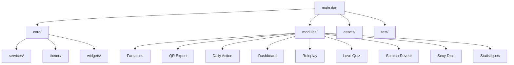

# Documentation Technique - App de Jeux pour Couples

## 1. Stack Technique
- **Langage principal :** Dart
- **Framework :** Flutter
- **Plateformes cibles :** Android, iOS, Web, Desktop (Windows, macOS, Linux)
- **Outils & Librairies :**
  - Gestion de dépendances : `pubspec.yaml`
  - Localisation : `l10n` (Flutter natif)
  - Génération de code : `build_runner`
  - Gestion d’état : Cubit / BLoC
  - Injection de dépendances : Provider (MultiProvider, ChangeNotifierProvider)
  - Stockage local : SharedPreferences (pas de chiffrement natif)
  - Notifications locales : flutter_local_notifications
  - Tests : `test/`
  - QR Code : qr_flutter, mobile_scanner
  - Thèmes dynamiques : ThemeProvider
  - Pas de backend, tout est offline
  - Pas de logging/crash reporting centralisé

---

## 2. Architecture Globale du Projet

L’application est structurée de manière modulaire pour séparer la logique transverse des fonctionnalités spécifiques.

## High Level Architecture

L’architecture de l’application est organisée selon une séparation stricte entre :

- **core/** : contient tous les éléments transverses et partagés (services, thèmes, widgets, constantes, gestion de version, etc.).
- **modules/** : chaque fonctionnalité ou jeu est un module indépendant, regroupant ses modèles, logique métier (BLoC/Cubit), vues et services associés.
- **assets/** : ressources statiques (JSON, images, etc.).
- **test/** : tests unitaires, d’intégration et de widgets.

Le point d’entrée (`main.dart`) initialise les services globaux, configure les providers (Provider/MultiProvider) et lance l’application avec le widget racine.

### Schéma d’architecture (vue simplifiée)

Cette architecture permet :
- Une forte isolation des modules (ajout/retrait sans impacter le reste de l’app)
- Une mutualisation des services et composants transverses
- Une évolutivité facilitée (ajout de nouveaux jeux/modules)

### 2.0 Principes d’architecture
- **Navigation** : Utilisation du Navigator natif de Flutter (Navigator 1.0). Le widget MaterialApp définit la propriété `home` selon l’état (DashboardScreen, AgeVerificationScreen, etc.). Navigation entre modules via Navigator.push classique.
- **Injection de dépendances** : Provider (MultiProvider au niveau racine, ChangeNotifierProvider pour les providers globaux comme LocaleProvider, ThemeProvider, UserProfileProvider). Pas de get_it ni de service locator avancé.
- **Initialisation des services globaux** : Les singletons (ex : NotificationService) sont initialisés dans main() avant le lancement de l’app.
- **Stockage local** : SharedPreferences pour la persistance des préférences, profils, thèmes, etc. Données stockées en clair, pas de chiffrement natif.
- **Internationalisation (i18n)** : Système natif Flutter (flutter_localizations, fichiers l10n, LocaleProvider). Pas de package externe.
- **Gestion des logs/erreurs** : Pas de logging centralisé ni de crash reporting. Les erreurs de (dé)sérialisation sont gérées localement (try/catch, valeurs par défaut).
- **Sécurité/confidentialité** : Toutes les données restent en local, aucune communication serveur. Pas de chiffrement, d’obfuscation ou de mécanisme anti-rétro-ingénierie en place.

### 2.1 Le dossier `core/` (Transverse)
Contient les éléments partagés à toute l’application.
- `app_version.dart` : Gestion de la version.
- `core.dart` : Fonctions et constantes globales.
- **`services/`** : Services globaux (ex: `notification_service.dart`).
- **`theme/`** : `theme.dart`, `theme_provider.dart`.
- **`widgets/`** : Composants UI génériques (boutons, dialogues, etc.).

### 2.2 Le dossier `modules/` (Fonctionnalités)
Chaque jeu ou fonctionnalité majeure est un module indépendant encapsulant ses modèles, son BLoC, ses vues et ses services.

---

## 3. Spécifications des Modules Actuels

### 3.1 Fantasies
- **Fichiers principaux :** `fantasies.dart` (point d'entrée).
- **Data/Models :** `fantasy.dart` (modèle), données via `fantasmes_en.dart`, `fantasmes_fr.dart`.
- **Logique :** `fantasy_service.dart` (gestion, QR, partage).
- **UI :** `modern_fantasy_card.dart`, `fantasies_screen.dart`, `common_fantasies_screen.dart`.

### 3.2 QR Export
- **Fichiers principaux :** `qr_export.dart`.
- **Data/Models :** `qr_models.dart`, `data_fr.dart`.
- **Logique :** `qr_service.dart` (génération/scan), `local_fantasy_service.dart`, `qr_diagnostic.dart`.
- **UI :** `compact_qr_widget.dart`, `fantasy_export_screen.dart`, `qr_scan_screen.dart`, `qr_import_result_screen.dart`.

### 3.3 Daily Action
- **Fichiers principaux :** `daily_action.dart`.
- **Data/Models :** Actions stockées en JSON (`assets/data/daily_actions_fr.json`), modèle `daily_action.dart`.
- **Logique (BLoC) :** `daily_action_cubit.dart`, `daily_action_state.dart`.
- **Services :** `daily_action_provider.dart` (lecture JSON), `daily_action_repository.dart`, `filter_preferences_service.dart`.
- **UI :** `daily_action_card.dart`, `filter_panel_widget.dart`, `daily_action_screen.dart`.

### 3.4 Dashboard
- **Fichiers principaux :** `dashboard.dart`.
- **Data/Models :** `dashboard_models.dart`, `dashboard_module.dart`, `dashboard_data.dart`.
- **Logique (BLoC) :** `dashboard_cubit.dart`, `dashboard_state.dart`, `dashboard_provider.dart`, `dashboard_service.dart`.
- **UI :** `dashboard_screen.dart`, sections isolées (`header`, `modules`, `qr`, `stats`).

### 3.5 Roleplay
- **Fichiers principaux :** `roleplay.dart`.
- **Data/Models :** `roleplay_scenario.dart`, constantes dans `roleplay_constants.dart`.
- **Logique (BLoC) :** `roleplay_cubit.dart`, `roleplay_session_cubit.dart`, `roleplay_state.dart`, `roleplay_data_service.dart`.
- **UI :** `roleplay_list_screen.dart`, `roleplay_scenario_detail_screen.dart`, `roleplay_session_screen.dart`.

### 3.6 Love Quiz
- **Fichiers principaux :** `love_quiz.dart`.
- **Data/Models :** `love_quiz_data.dart`.
- **Logique :** `love_quiz_service.dart`.
- **UI :** `quiz_question_animation_mixin.dart` (animations), `love_quiz_screen.dart`, `love_quiz_question_screen.dart`, `love_quiz_results_screen.dart`.

### 3.7 Scratch Reveal
- **Fichiers principaux :** `scratch_reveal.dart`.
- **Data/Models :** `scratch_position.dart`, `scratch_theme.dart`.
- **Logique (BLoC) :** `scratch_cubit.dart`, `scratch_state.dart`, `scratch_repository.dart`.
- **UI :** `scratch_card_widget.dart` (effet scratch), `scratch_grid_screen.dart`, `scratch_modal.dart`.

### 3.8 Sexy Dice
- **Fichiers principaux :** `sexy_dice.dart`.
- **Data/Models :** `sexy_dice_data_en.dart`, `sexy_dice_data_fr.dart`.
- **Logique (BLoC) :** `sexy_dice_cubit.dart`, `sexy_dice_state.dart`, `sexy_dice_service.dart`.
- **UI :** `dice_result_card.dart`, `intensity_selector.dart`, `sexy_dice_screen.dart`.

### 3.9 Statistiques
- **Fichiers principaux :** `stats.dart`.
- **Data/Models :** `achievement.dart`, `user_stats.dart`, `user_level.dart`, données locales (`achievements_fr.dart`).
- **Logique :** `stats_service.dart`, `stats_integration_service.dart`, `streak_service.dart`.
- **UI :** `stats_screen.dart`, `achievement_widgets.dart`, `stat_widgets.dart`.

---

## 4. Sécurité et Confidentialité
- **Stockage local :** Toutes les données (profils, préférences, historiques, fantasmes, etc.) sont stockées localement via SharedPreferences, en clair (pas de chiffrement natif). Pas d’utilisation de Hive ou SQLite. Les données sensibles ne sont pas chiffrées.
- **Aucune donnée serveur :** L’application fonctionne entièrement offline, sans backend. Les échanges entre appareils se font via QR Code. Aucun envoi de données personnelles sur un serveur externe, ce qui garantit la confidentialité.
- **Sécurité applicative :** Pas de mécanisme d’obfuscation ou de protection contre la rétro-ingénierie. Pas de gestion d’accès avancée.